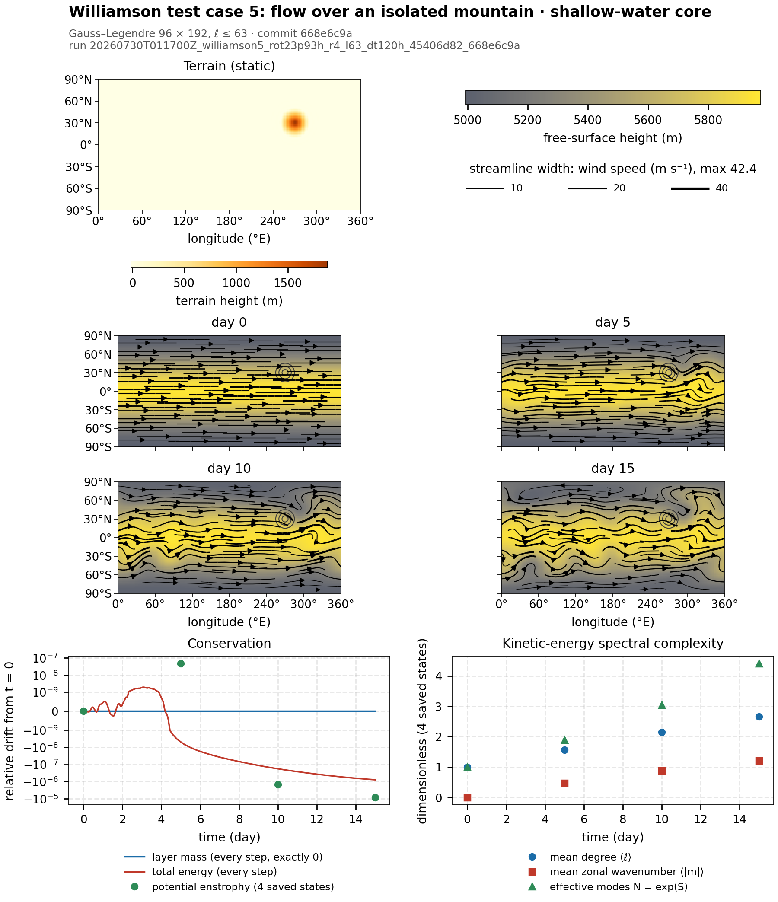

# Palintropos

**A GPU spectral laboratory for idealized flow on a rotating sphere.**

Put a thin layer of fluid on a spinning sphere and it does not stay smooth.
Rotation, curvature, and the variation of the Coriolis parameter with latitude
organize it into jets, long-lived vortices, and planetary-scale waves.
Palintropos is research software for watching that organization come out of
the equations themselves: idealized dynamical cores written in spherical
harmonics, with conservation diagnostics and run provenance, so each claim can
be traced back to a recorded run.

It is **not** a climate or weather model. Its solvers are idealized: no forcing,
no moisture, no radiation, no real or data-driven terrain. They do not model any
particular planet, real or fictional.



*Williamson test case 5, flow over an isolated mountain, from the canonical T63
run (Gauss–Legendre grid 96 × 192, ℓ ≤ 63, inviscid; commit `668e6c9a`,
2026-07-30, one GPU run). A zonal jet meets a conical mountain (top left: the
band-limited terrain) and sets up a global wave train over 15 days. The maps
share one free-surface-height scale; streamlines are instantaneous, with width
proportional to wind speed, and the circles are the terrain at 500, 1000 and
1500 m. Layer mass stays bit-identical to day 0 at every step. Over 15 days,
total energy drifts by −7.9 × 10⁻⁷ (recorded every step) and potential
enstrophy by −8.5 × 10⁻⁶ (evaluated at the four saved states only). In
kinetic-energy mode space, the flow starts as a single mode (mean degree
⟨ℓ⟩ = 1) and spreads to ⟨ℓ⟩ ≈ 2.7 and about 4.4 effective modes by day 15.
[Definitions and full evidence →](docs/validation/williamson5_mri_2026-07-30.md#41-spectral-complexity-of-the-t63-snapshots)*

The figure is an asset of the run it draws, which is published with a
checksum receipt in [docs/runs](docs/runs/README.md). It is drawn by a
pinned recipe, and every number it shows is in
[overview.json](docs/runs/20260730T011700Z_williamson5_rot23p93h_r4_l63_dt120h_45406d82_668e6c9a/assets/overview.json).
To redraw it (needs CUDA), or to draw the same kind of overview for any saved
run:

```powershell
python docs/figures/williamson5_t63_overview.py   # this figure, from its recipe
tropoi plot RUN_PATH                               # default overview of any saved run
```

## What you can study with it today

- **How rotating flow organizes itself.** Vortex interaction, Rossby–Haurwitz
  waves, and mountain-forced wave trains, all measured against the
  invariants the continuous equations conserve.
- **How energy moves between scales.** Every run records spectra and per-step
  diagnostics, so you can watch energy spread from a few modes to many while
  mass, energy, and enstrophy drift stays small.
- **How much the grid itself affects the result.** The same model can run on
  two grids that share one spectral layout, which exposes quadrature and
  grid-orientation error that a single grid would hide.

Palintropos cannot yet answer questions about climate, heat transport, or how
circulation changes with the planet's parameters. Those need forcing,
dissipation, and validated long integrations. The foundations are the spectral
machinery, the diagnostics, and the provenance.

## Model cores

All three cores are spectral (spherical harmonics, `float64`/`complex128`) and
use explicit RK4 time stepping.

| Core | Command | Prognostic state | Evidence so far | Limits |
|---|---|---|---|---|
| **Barotropic vorticity (BVE)** | `tropoi run bve` | relative vorticity | RH4 traveling wave on both grids; conservation and rotation-equivalence tests | Single layer, non-divergent. Optional Laplacian viscosity has no stability control of its own |
| **Rotating shallow water (SWE)** | `tropoi run swe` | vorticity, divergence, perturbation thickness geopotential | Linear gravity-wave dispersion, Williamson 2, exact lake at rest over terrain, Williamson 5 compared with an external model | Inviscid, single layer. Terrain is either one analytic Gaussian mountain or the benchmark cone |
| **Dry hydrostatic primitive equations (PE)** | `tropoi run pe` | per-level vorticity, divergence, temperature; ln surface pressure | Exact rest; smooth short evolution; analytic orographic balance (to roundoff on the Gauss grid) | Early work. Fixed user-chosen step, no CFL controller, no forcing or hyperdiffusion, no energy-conservation claim, short demonstrations only |

BVE and SWE pick their time step adaptively from an advective CFL limit that
is recomputed after every accepted step. The PE runner uses a fixed step.
Details: [SHALLOW_WATER.md](docs/SHALLOW_WATER.md),
[PRIMITIVE_EQUATIONS_RUNNER.md](docs/PRIMITIVE_EQUATIONS_RUNNER.md),
[MATHEMATICAL_MODEL.md](docs/MATHEMATICAL_MODEL.md).

**Two grids, one coefficient layout.** Every core runs on either grid, chosen
with `--backend`:

- **`gauss-latlon`: the reference grid.** A Gauss–Legendre latitude–longitude
  grid. It transforms band-limited fields exactly to floating-point precision:
  in one measured round trip at `L = 21`, the relative L2 residual was
  ≈ 7 × 10⁻¹⁵.
- **`geodesic` (default): experimental.** An icosahedral grid. Its quadrature
  is approximate and depends on how the grid is oriented: the same round trip
  left a residual of ≈ 1 × 10⁻².

## Install

You need Python 3.12, Git, and an NVIDIA GPU with a working CUDA driver and
toolkit. **There is no production CPU solver.** Without CUDA you can still
open, inspect, and read saved runs, but you cannot run a model.

The validated environment is Windows, Python 3.12.12, CuPy 13.4.0, CUDA 11.8,
and an NVIDIA GeForce MX110. The commands below are for PowerShell.

```powershell
git clone https://github.com/AlexandreEros/Palintropos.git
cd Palintropos
py -3.12 -m venv venv
.\venv\Scripts\Activate.ps1
pip install -r requirements.txt
pip install -e .
tropoi --help
```

`requirements.txt` pins `cupy-cuda11x==13.4.0`. For CUDA 12.x, swap that one
line for `cupy-cuda12x==13.4.0`, and install only one CuPy package. CUDA 12 has
not been validated by this repository's benchmarks. If PowerShell blocks venv
activation, run `Set-ExecutionPolicy -Scope Process -ExecutionPolicy Bypass`,
which applies to the current session only, and activate again.

Package names:

| What | Name |
|---|---|
| Distribution | `palintropos` |
| Python import | `tropoi` |
| Command-line tool | `tropoi` |

`aeolus`, `psx-bve`, `psx-gen`, and `psx-recompile` still work as
compatibility commands from the project's time as *Aeolus*. The old
`planetary_sandbox` import path does not.

## Quick start

This runs a short two-vortex BVE smoke test: `l_max = 8`, about half an hour of
simulated time.

```powershell
tropoi run bve --preset two-vortices-quick
```

On an MX110 the whole run took about 30 s (measured 2026-09-23). The command
prints the absolute path of the run it wrote under `runs/` and updates
`runs/latest_run.txt`.

Other ready-made runs:

```powershell
tropoi run bve --preset two-vortices-quick --backend gauss-latlon   # same run, reference grid
tropoi run bve --preset rh4          # one-day Rossby–Haurwitz wave-4 validation configuration
tropoi run swe                       # one-day Williamson 2 (steady zonal flow)
tropoi run pe                        # tiny dry primitive-equation thermal-wave demo
tropoi list presets
tropoi list scenarios
```

`tropoi run <bve|swe|pe> --help` lists every option. Flags you pass explicitly
override the preset's values.

## Outputs and saved runs

Each run writes a self-contained directory containing:

- `manifest.json` and `config.json`: the full configuration plus provenance
  (Git commit and worktree state, GPU, library versions).
- `diagnostics/timeseries.csv`: the conservation diagnostics, one row per
  accepted step.
- `diagnostics/spectra.npz` (BVE runs only): degree spectra of energy and
  enstrophy, every tenth recorded step.
- Saved spectral states, their time axis, and figures.

How many states are saved is controlled by `--n-snapshots N` (default 5,
including `t = 0` and the end). `--plot` and `--no-plots` control which figures
are rendered. States and diagnostics are written even with `--no-plots`.

Each solver saves its states under its own file names:

| Solver | Spectral states | Time axis | Also saved |
|---|---|---|---|
| BVE | `vorticity_coeffs.npy` | `bve_snapshot_times.npy` | `vorticity_grid.npy` (gridded vorticity) |
| SWE | `swe_coeffs.npy` | `swe_snapshot_times.npy` | |
| PE | `pe_coeffs.npy` | `pe_snapshot_times.npy` | |

**Inspect a run from the shell.** This works without a GPU and never
initializes CUDA:

```powershell
tropoi inspect runs                              # summary of the latest run
tropoi inspect runs --snapshot -1 --field zeta   # one saved state: time, units, shape, convention checks
```

**Read a run from Python.** The Simulation/Snapshot API is read-only. Opening a
run memory-maps its arrays without CUDA:

```python
from tropoi.representation.archive import open_simulation

sim = open_simulation("runs")                # a run directory, or a base dir with latest_run.txt
sim.times                                    # saved times in seconds
snap = sim[-1]                               # index of a saved output, not a time
snap.state["zeta"].coeffs                    # read-only (l, m) coefficient view
snap.plot(output_path="zeta_last.png")       # renders the same figure the run produced
```

**Draw a run.** `Simulation.plot` and `tropoi plot` draw any saved BVE, SWE or
PE run; you choose the filled quantity, contours, the wind overlay, the saved
times and the diagnostics panels:

```python
from tropoi.representation.visual.views import Map, Streamlines

sim.plot()                                   # default overview -> RUN/assets/overview.png
sim[-1].plot("flow.png", Map(None, vectors=Streamlines()))   # streamlines alone
sim.quantities()                             # what this run can draw: meaning, units, cadence
```

```powershell
tropoi plot runs                                            # -> <latest run>/assets/overview.png
tropoi plot runs --list-quantities                          # no GPU needed
tropoi plot runs --map vorticity --vectors arrows --snapshots 0,-1
```

- The fields are `zeta` (BVE), `zeta`/`delta`/`phi` (SWE), and
  `zeta`/`delta`/`temperature`/`ln_ps` (PE).
- `Snapshot.plot` and `Simulation.plot` build nothing until you call them.
  Maps of physical fields need CUDA: the run's model is rebuilt once. Without a
  view, `Snapshot.plot` draws the run's own snapshot figure;
  `representation="spectral"` renders that on the CPU, for BVE and SWE only.
- Figures belong to their run: by default they go to `RUN/assets/`, the only
  place inside a run that plotting writes. `assets/` holds derived,
  reproducible products; it is not part of the run's evidence, identity or
  checksums. `-o PATH` writes elsewhere.
- Values that exist only at saved states, such as potential enstrophy, are
  drawn as markers, never as a per-step line.
- The API does not interpolate in time or restart runs.

Full reference: [docs/SAVED_RUNS.md](docs/SAVED_RUNS.md).


*A qualitative BVE example: two compact vortices stretch into filaments and
planetary-scale structure over ten days. Setup: experimental geodesic grid at
resolution 4, `l_max = 21`, 24 h rotation, inviscid. It was run at commit
`4a840226` with uncommitted local changes. Over the ten days, energy drops by
3.7 % (printed on the day-10 panel), so treat this as an illustration, not
conservation evidence. Full configuration:
[figure provenance](docs/assets/provenance.json).*

## Validation: measured, not guaranteed

The numbers below are measurements of the discrete solvers in specific
configurations. They are not analytic guarantees. Conservation is measured, not
proven: the saved state keeps modes above the cut at which nonlinear tendencies
are truncated.

| Evidence | Result | When and where |
|---|---|---|
| Williamson 5 vs the MRI-JMA reference model, day-0 check with tolerances fixed in advance (T42, T63) | **passed** by 3–4 orders of magnitude | commit `668e6c9a`, 2026-07-30; Gauss grid; NVIDIA RTX PRO 6000 Blackwell on Google Colab |
| Williamson 5, 15-day inviscid runs (T42, T63) | completed; mass drift **0.0** (bit-identical); energy drift **+3.4 × 10⁻⁷ / −7.9 × 10⁻⁷** | same |
| Williamson 5, day-15 free surface vs MRI-JMA | weighted RMS difference **5.6 m / 4.7 m**, on a layer about 5620 m deep | same |
| RH4, 5 days, matched timestep | relative energy drift: geodesic **−4.46 × 10⁻⁴**, Gauss **−1.34 × 10⁻¹⁰** | `feat/latlon-grid` review, 2026-07-12; MX110 |

**Williamson 5 is a comparison between two numerical models.** Williamson 5
has no exact solution: the reference is another model's high-resolution
output, which has its own discretization error. The results do not claim
agreement with truth, identical agreement with MRI-JMA, or a convergence
order (two resolutions cannot measure one).
[Full report →](docs/validation/williamson5_mri_2026-07-30.md)

**Tests.** GitHub CI and local GPU runs cover different tests, so their counts
should not be added together:

| Where | What runs | Result at `8892ee6` (2026-09-23) |
|---|---|---|
| GitHub Actions ([`tests.yml`](.github/workflows/tests.yml)) | `ubuntu-latest`, Python 3.12, **no CuPy, no GPU**: only the CPU tests (configuration, CLI, run directories, saved-run API, provenance, layout) | 530 passed, 400 skipped (the tests that need CUDA skip themselves) |
| Local, full suite | Windows, Python 3.12.12, CuPy 13.4.0, NVIDIA GeForce MX110 | 951 passed, 1 skipped (the opt-in 15-day Williamson-5 acceptance run, `TROPOI_W5_ACCEPTANCE=1`); took 9 min |

GitHub CI **does not run** the CUDA numerics. The full suite runs locally on a
GPU before each merge. See [ARCHITECTURE.md § Tests](docs/ARCHITECTURE.md#tests).

## Limitations

- No forcing, moisture, radiation, or real or time-varying terrain in any
  solver. The terrain from `Planet.generate` is decorative only.
- BVE and SWE are single-layer. The PE core has only been run in short,
  fixed-step demonstrations.
- There is no semi-implicit time stepping. There is no stability control for
  explicit viscosity. The PE core has no CFL control.
- The geodesic grid's quadrature is approximate and depends on how the grid is
  oriented. The Gauss grid is the reference.
- The code runs on GPU only, and results depend on one GPU implementation:
  there is no independent CPU core to cross-check against.
- The default dense transforms limit resolution on small GPUs. Windows display
  GPUs can hit driver timeouts (TDR) on large kernels.

Details: [KNOWN_LIMITATIONS.md](docs/KNOWN_LIMITATIONS.md) and
[KNOWN_RISKS.md](docs/KNOWN_RISKS.md).

## Further reading

- [VALIDATION.md](docs/VALIDATION.md): RH4 grid comparison (with figure),
  Williamson-5 summary, conservation and rotation-equivalence tests.
- [Williamson 5 vs MRI-JMA, 2026-07-30](docs/validation/williamson5_mri_2026-07-30.md):
  the full report, figures, provenance, and checksums.
- [ARCHITECTURE.md](docs/ARCHITECTURE.md): package layout, grids, transform
  flow, run directories, CPU/GPU boundaries, and tests.
- [SAVED_RUNS.md](docs/SAVED_RUNS.md): the read-only saved-run interface.
- [SHALLOW_WATER.md](docs/SHALLOW_WATER.md),
  [PRIMITIVE_EQUATIONS_DESIGN.md](docs/PRIMITIVE_EQUATIONS_DESIGN.md),
  [PRIMITIVE_EQUATIONS_RUNNER.md](docs/PRIMITIVE_EQUATIONS_RUNNER.md), and
  [MATHEMATICAL_MODEL.md](docs/MATHEMATICAL_MODEL.md): equations and
  conventions.
- [VALIDATION_PLAN.md](docs/VALIDATION_PLAN.md) and
  [docs/validation/](docs/validation/): the planned benchmarks and the dated
  audit records.
